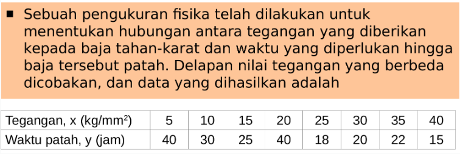
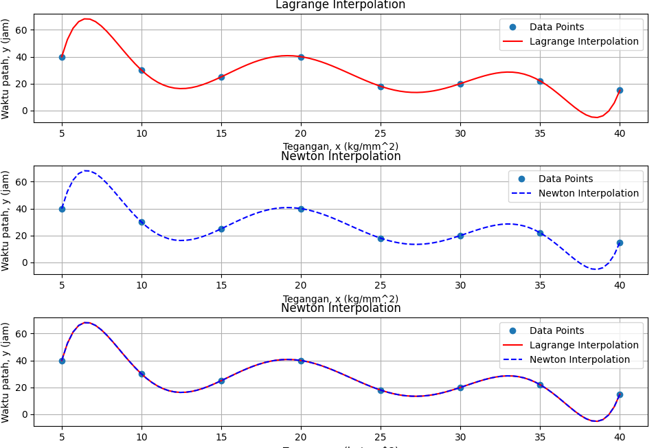

# Implementasi Interpolasi Langrange dan Newton
Program ini merupakan program yang digunakan untuk menghitung hasil interpolasi dengan 2 metode, yaitu:
* Langrange
* Newton

## Panduan File dan Direktori

Pada repositori ini terdapat beberapa file serta direktori, ada beberapa hal yang perlu diketahui, yaitu:
* Pada direktori ***polynom*** berisi beberapa file yang terdiri dari 2 Class, yaitu ***polynomLangrange***, dan ***polynomNewton***. Class-class tersebut digunakan untuk menghitung hasil interpolasi sesuai metodenya.
* File ***main.py*** adalah file program yang digunakan untuk mengimplementasikan Class serta Function yang ada pada 2 Class yang sudah disebutkan diatas
* Sebelum menjalankan program, pastikan terdapat Library ***Numpy*** dan ***Numpy***dikarenakan program ini menggunakan library tersebut

## Berikut contoh penerapannya

Hasil running program 

